<h2 align="center">Hi, I'm Aniket Humbe</h2>

  <picture>
    <source media="(prefers-color-scheme: dark)" srcset="./assets/terminal-dark.svg">
    <source media="(prefers-color-scheme: light)" srcset="./assets/terminal-light.svg">
    
  </picture>

  <picture>
    <source media="(prefers-color-scheme: dark)" srcset="./assets/contributions-dark.svg">
    <source media="(prefers-color-scheme: light)" srcset="./assets/contributions-light.svg">
    
  </picture>

  <picture>
    <source media="(prefers-color-scheme: dark)" srcset="./assets/stats-dark.svg">
    <source media="(prefers-color-scheme: light)" srcset="./assets/stats-light.svg">
    
  </picture>

**Currently building:** automation and AI-agent tooling at Hexalog, plus [EHMR AI](https://github.com/humbeaniket2006-max/My_EHMR).

  <picture>
    <source media="(prefers-color-scheme: dark)" srcset="./assets/projects-dark.svg">
    <source media="(prefers-color-scheme: light)" srcset="./assets/projects-light.svg">
    
  </picture>

| Project | What it does | Stack |
|---|---|---|
| [**EHMR AI**](https://github.com/humbeaniket2006-max/My_EHMR) | Senior-care health platform with separate patient and hospital dashboards, JWT auth, and an LLM layer that generates risk insights from vitals and lab data. [Live demo](https://my-ehmr.onrender.com). | Node.js, Express, MongoDB, Groq (Llama 3.3), Docker |
| **Ads Library MCP** (private) | Internal MCP server for ads library data. Kept private as an internal tool. | MCP |
| [**Ocular-Core (Lite)**](https://github.com/humbeaniket2006-max/Ocular_Core_Lite) | Research prototype that generates synthetic biological texture data on Intel CPUs, no GPU needed, using OpenVINO-optimized latent consistency models. | Python, OpenVINO, Jupyter |
| [**Brand Knowledge Auto-Builder**](https://github.com/humbeaniket2006-max/-brand-knowledge-builder) | Takes a D2C brand URL and generates a JSON knowledge pack (catalog, FAQs, policies, tone) for onboarding the brand onto PineOS. | Python, Jupyter |
| **Freshsales MCP** (private) | Read-only MCP server that exposes live Freshsales CRM data to Claude, with a two-step propose-and-approve flow on every tool call. | TypeScript, MCP SDK |
| [**CRM Lead Service**](https://github.com/humbeaniket2006-max/Website--CRM) | Microservice that writes website lead form submissions directly into Freshsales CRM. | Node.js, Express |

  <picture>
    <source media="(prefers-color-scheme: dark)" srcset="./assets/stack-dark.svg">
    <source media="(prefers-color-scheme: light)" srcset="./assets/stack-light.svg">
    
  </picture>

**Languages** &nbsp;

**Backend** &nbsp;

**Tools** &nbsp;

  <picture>
    <source media="(prefers-color-scheme: dark)" srcset="./assets/links-dark.svg">
    <source media="(prefers-color-scheme: light)" srcset="./assets/links-light.svg">
    
  </picture>

