<h2 align="center">Hi, I'm Aniket Humbe 👋</h2>

  <picture>
    <source media="(prefers-color-scheme: dark)" srcset="./assets/dark.svg">
    <source media="(prefers-color-scheme: light)" srcset="./assets/light.svg">
    
  </picture>

  Data Science student at IIT Madras. Building at the Institute of Venture Building (IVB), Chennai. 
  Focus areas: edge AI, computer vision, LLM tooling, and full-stack web development.

  
  
  
  
  
  
  
  
  

---

**Currently building:** automation and AI-agent tooling at Hexalog, alongside [EHMR AI](https://github.com/humbeaniket2006-max/My_EHMR), a full-stack healthcare platform, and a few smaller full-stack services.

### Featured projects

| Project | What it does | Stack |
|---|---|---|
| [**EHMR AI**](https://github.com/humbeaniket2006-max/My_EHMR) | Full-stack senior-care health platform: dual patient/hospital dashboards, JWT auth, and an LLM-powered risk-insights layer over vitals and lab data. [Live demo](https://my-ehmr.onrender.com). | Node.js, Express, MongoDB, Groq (Llama 3.3), Docker |
| [**JCAS AI**](https://github.com/humbeaniket2006-max/JCAS_AI) | Elderly-care dashboard prototype built for the METI Japan Internship 2026, aligned to Society 5.0. Includes dementia and fall-risk screening with dual doctor/patient views. | JavaScript, Groq LLaMA 3.3 70B |
| [**Ocular-Core (Lite)**](https://github.com/humbeaniket2006-max/Ocular_Core_Lite) | Research prototype generating synthetic biological texture data on Intel CPUs (no GPU) using OpenVINO-optimized latent consistency models. | Python, OpenVINO, Jupyter |
| [**Brand Knowledge Auto-Builder**](https://github.com/humbeaniket2006-max/-brand-knowledge-builder) | Takes a D2C brand URL and generates an AI-ready JSON knowledge pack (catalog, FAQs, policies, tone) for onboarding onto an AI platform. Built for PineOS. | Python, Jupyter |
| **Freshsales MCP** (private) | Read-only MCP server exposing live Freshsales CRM data to Claude, with a two-step propose-and-approve flow on every tool call. | TypeScript, MCP SDK |
| [**CRM Lead Service**](https://github.com/humbeaniket2006-max/Website--CRM) | Microservice that takes a website lead form and writes submissions directly into Freshsales CRM. | Node.js, Express |

### Contact

[GitHub](https://github.com/humbeaniket2006-max) · [humbeaniket2006@gmail.com](mailto:humbeaniket2006@gmail.com)
